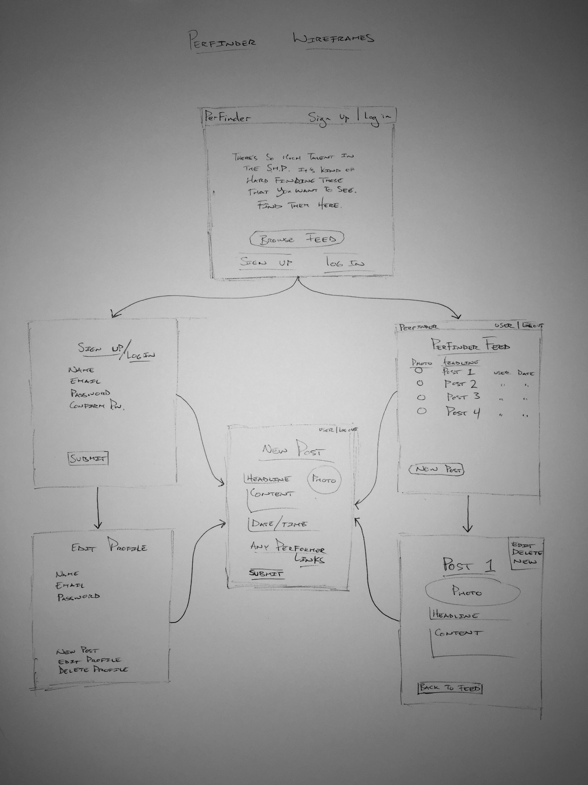

# Project2 - Buskr

Buskr is an application intended to enable people who saw performers on Santa Monica's Third Street Promenade to be able to post their favorites, find performers they didn't get the website of, browse what impressed other users, or find more information on upcoming performances of performers they saw.

Trello:
https://trello.com/b/MW3fx20l/wdi-project-2-buskr

Heroku link:
https://buskr.herokuapp.com/

#####MVP
Users will be able to browse posts by other users who have seen promenade performers who impressed them and/or that they took a picture of but need further info about.  In this way, users can learn more about performers and help each other find and follow their favorite street performers (or just performers that they wanted to know more about or remember the name of).  Street Performers will benefit by increased exposure, recognition, and following. Maybe.

Technologies used:
HTML 5, CSS 3, Sass, JavaScript, jQuery, Bootstrap, ruby, rails, PostgreSQL and Devise

<!-- Approach taken: -->

Installation/startup instructions:
Go to the as-yet-unbuilt website and sign up, browse, post, learn, and enjoy.

<!-- Unsolved problems and next steps. -->

ERD

Wireframes

